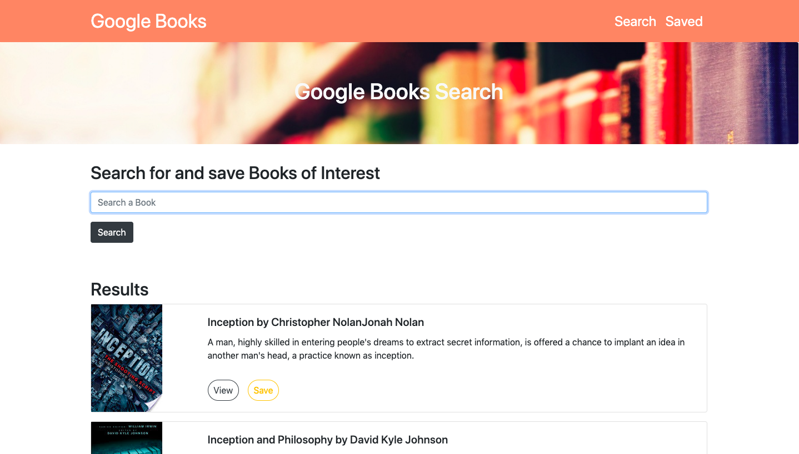

# Google Books Search

This project was bootstrapped with [Create React App](https://github.com/facebook/create-react-app).

This is a React-based Google Books Search app where users can make a reasearches on books and save them to review or purchase later. 

## Technologie used

Build a full stack application with MongoDB, Express.js, React and Node.js (MERN)
<h2 align="center">

</h2>

## Author

Victoire Baron